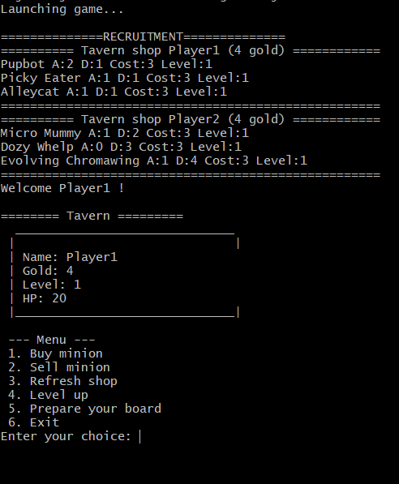
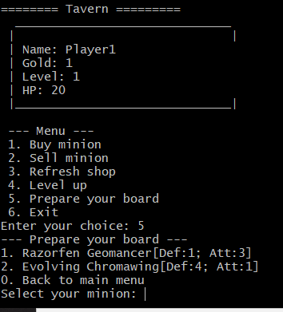
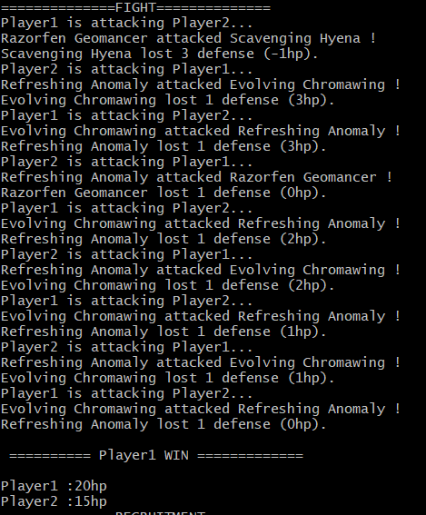

# Welcome on HeartStone Battlegrounds !


**As part of our final object-oriented programming project, we developed a game inspired by Hearthstone battlegrounds!**

This game is our first version and available only in command line, please be indulgent ;-).

## Start the game

To launch this game, you can compile Java code with Eclipse or other IDE or just use this command at the project's root:

```sh
java -jar ./executable/hearthstone_battlegrounds.jar
```

## Rules of the game

The rules of the game are simple, collect cards and advantages and stay alive!

Each turn you must choose a card to add to your deck. Each player is allowed to have a maximum of 6 cards in his hand and 4 only on the board.

You earn one gold coin per turn and each Minion costs 3 gold coins.

The cards you have access to depend on your level, the higher your level the more rare and powerful cards you have access to.

To upgrade your Tavern, you will have to pay 5 gold coins on the first turn or wait for the cost to drop as it decreases by 1 from turn to turn.

### Tavern

In this game, you will discover what we call a **Tavern**. The Tavern is a place to buy, sell and upgrade cards in your deck. It is also where you will prepare your strategy...

Players will take turns going to the Tavern and making their choices.

You will start the game with **3 gold coins** to choose your first card. Each card, or "Minion", has attributes: Attack, Defense, Rank.

When one of your cards attacks an opponent's card, it will deduct its attack points from the opponent's defense points.

In turn, your cards from left to right will attack an opponent's card randomly and vice versa. The goal is to have at least one card still alive on the board.

### Board

Let's talk about the game board. This board allows you to place a maximum of 4 cards for combat. The position of the cards is imputed to you and you can change it in the menu of your Tavern.


### Recruitment or Fight ?

The game alternates between two phases:
- recruitment phase: this phase consists of preparing your game board by recruiting or selling new Minions.
- fight phase: this phase is automatic and will alternate between your opponent's attacks and yours.

The first player to run out of cards on the board loses the round and has the level of the opponent's Tavern deducted from his level.

The first player to reach 0 life points loses the game.


### Tribe

A tribe system has been implemented in the game and allows you to improve certain cards or have advantages. Indeed, each card is associated with a tribe that brings you improvements. For example, the "Pirate" tribe accelerates your gold gain each turn.

Note that you must have the card in your deck to have its advantages.

Here, all implemented Tribes :

| Tribe      | Description | Implemented ?
| ------|-----|-----|
| Pirate  	| *Accelerates your gold retribution.* 	| Y 	|
| Elemental  	| *Allows you to add 7 minions in your hand.* 	| N 	|
| Beast  	| *Upper your beast minions attack (+2).* 	| Y 	|
| Demon  	| *Upper your level (+1)* 	| Y 	|
| Dragon  	| *Upper your dragon minions defense (+2).* 	| Y 	|
| Mech  	| *Give you 1 hp at each turn* 	| Y 	|
| Murloc  	| *Accelerates the reduction of tavern's cost.* 	| N 	|
| Naga  	| *Each minion in your shop costs one gold less.* 	| N 	|
| Quilboar  	| *For the next turn, your level cost will be 0.* 	| N 	|
| Warrior  	| *It's a simple minion, but he will be faithful to you* 	| Y |

## Menu



Each turn, you will access to this menu to prepare your deck.

You will enter your option number to choose action.

### Board

To prepare your board, you can swap card position by selecting a Minion and precise his new position.



Your first card in you board begin to attack at the next turn.

### Fight

The last player with cards on his board win the round :




[Voir la doc technique](./doc/technique/technique.md)