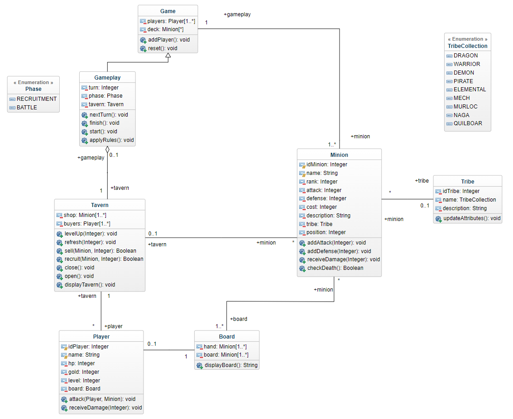

# Documentation technique

```Environnement de développement: Java JDK 8.0```

Voici le diagramme de classe que nous avons mis en place



Dans le projet nous distinguons plusieurs classes Java :  
    - Launcher (starter)  
    - Gameplay (game rules and logic)  
    - Game (main class with players list)  
    - Player (player with attributes)  
    - Minion (card)  
    - Tavern (tavern to buy, sell or update)  
    - Tribe (special cards attributes)  
    - Board (board game)  

Le diagramme UML est globalement bien respecté même si nous avons du faire des ajustements en cours de route et faire des choix.

Par exemple, nous avons fais le choix d'ajouter de nouveaux attributs à certaines classes pour faciliter le fonctionnement. (ex: ```originalDefense``` dans la classe Minion qui correspond à la valeur originale de sa défense, cela nous permet de la réinitialiser après le combat)

Les énumérations nous permettent d'avoir des valeurs strictes et non modifiables.

## Problèmes rencontrés et solutions envisagées

Nous avons rencontrés différentes difficultés pendant la conception de ce projet :

* le partage de la Taverne

En effet, les règles consistaient à proposer aux joueurs un deck de cartes partagé afin qu'il ne puissent pas avoir les mêmes cartes. Il a donc fallu proposer une Taverne partagée entre les joueurs.

Le système que nous avons mis en place nous permet d'accueillir plusieurs joueurs au sein d'une seule Taverne (sous forme de liste d'acheteurs). Cela sera utile si d'autres joueurs doivent être intégrés au jeu.

* la modification des attributs des cartes

Lorsque nous modifions une carte, la POO fait que cette modification entraîne l'édition de l'instance de l'objet et donc de l'objet dans son ensemble, peu importe où qu'il se situe.

Nous avons été confrontés à cet enjeu dans le cas où nous avions des doublons dans certains decks de joueurs. Il a donc fallu rendre les cartes dans les decks unique : un joueur ne peut pas avoir dans son shop une carte qu'il a déjà en main ou qu'un autre joueur possède.

* logique des achats et des ventes

Dans ce projet, il a aussi fallu prendre en compte les achats et ventes de cartes dans certains cas précis. Par exemple, si un joueur sans or vend une carte dans la Taverne, il gagne 1 pièce mais ne peut pas racheter de cartes derrière.
Dans le cas où ce serait sa dernière carte, on aurait une impasse, nous avons donc ajouté une contrainte lors de la vente : min 1 carte en main et au moins 3 pièces d'or.